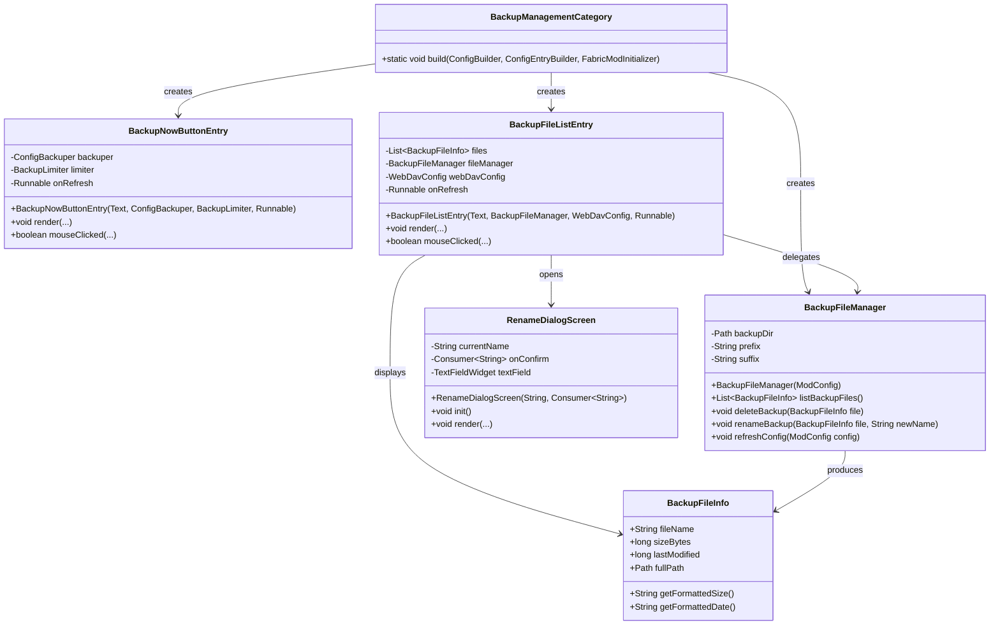
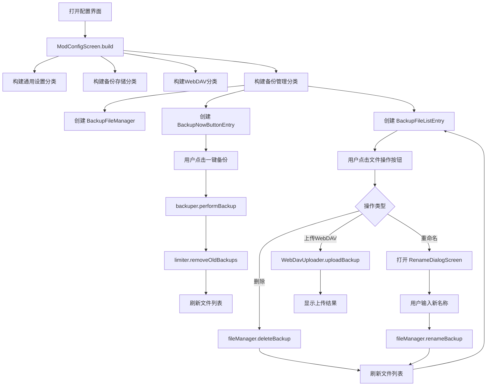

# 备份管理栏目架构方案

## 1. 概述

在现有 Cloth Config 配置界面中新增第 4 个分类「备份管理」（Backup Management），提供一键备份、文件列表浏览、单个文件删除/重命名/上传 WebDAV 等操作能力。

---

## 2. 新增文件清单

| # | 文件路径 | 职责 |
|---|---------|------|
| 1 | `config/BackupManagementCategory.java` | 备份管理栏目的构建入口，组装所有控件 |
| 2 | `config/widget/BackupNowButtonEntry.java` | 自定义 Cloth Config 条目，渲染「一键备份」按钮 |
| 3 | `config/widget/BackupFileListEntry.java` | 自定义 Cloth Config 条目，渲染备份文件列表（含每行的操作按钮） |
| 4 | `config/widget/RenameDialogScreen.java` | 重命名输入对话框（Minecraft Screen） |
| 5 | `config/model/BackupFileInfo.java` | 备份文件信息数据模型（文件名、大小、修改时间） |
| 6 | `config/BackupFileManager.java` | 备份文件扫描、删除、重命名等操作逻辑（与 UI 解耦） |

### 目录结构

```
fabric/src/main/java/com/naocraftlab/configbackuper/config/
├── ModConfigScreen.java              # 修改：新增第4个分类
├── ModMenuIntegration.java           # 不变
├── BackupManagementCategory.java     # 新增
├── BackupFileManager.java            # 新增
├── model/
│   └── BackupFileInfo.java           # 新增
└── widget/
    ├── BackupNowButtonEntry.java     # 新增
    ├── BackupFileListEntry.java      # 新增
    └── RenameDialogScreen.java       # 新增
```

---

## 3. 类图



---

## 4. 详细设计

### 4.1 [`BackupFileInfo`](fabric/src/main/java/com/naocraftlab/configbackuper/config/model/BackupFileInfo.java) — 数据模型

纯数据类，封装单个备份文件的信息：

```java
public class BackupFileInfo {
    private final String fileName;
    private final long sizeBytes;
    private final long lastModified;
    private final Path fullPath;

    // 构造函数、getter

    public String getFormattedSize() {
        // 将字节数格式化为 KB/MB/GB 可读形式
    }

    public String getFormattedDate() {
        // 将 lastModified 时间戳格式化为 yyyy-MM-dd HH:mm:ss
    }
}
```

### 4.2 [`BackupFileManager`](fabric/src/main/java/com/naocraftlab/configbackuper/config/BackupFileManager.java) — 文件操作逻辑层

职责：
- 扫描备份目录，按 prefix + suffix 过滤文件
- 按 lastModified 降序排序（最新在前）
- 封装 `Files.delete()` 删除操作
- 封装 `Files.move()` 重命名操作
- 提供刷新配置的方法（当用户在设置中修改了 prefix/suffix/backupFolder 后调用）

```java
public class BackupFileManager {
    private Path backupDir;
    private String prefix;
    private String suffix;

    public BackupFileManager(ModConfig config) {
        refreshConfig(config);
    }

    public void refreshConfig(ModConfig config) {
        this.backupDir = resolveBackupDirectory(config);
        this.prefix = config.getBackupFilePrefix() != null ? config.getBackupFilePrefix() : "backup";
        this.suffix = config.getBackupFileSuffix() != null ? config.getBackupFileSuffix() : ".zip";
    }

    public List<BackupFileInfo> listBackupFiles() {
        // 1. 检查目录是否存在
        // 2. Files.list(backupDir) 遍历
        // 3. 按 prefix + suffix 过滤
        // 4. 映射为 BackupFileInfo
        // 5. 按 lastModified 降序排序
        // 6. 返回 List
    }

    public void deleteBackup(BackupFileInfo file) throws IOException {
        Files.delete(file.getFullPath());
    }

    public void renameBackup(BackupFileInfo file, String newName) throws IOException {
        Path target = file.getFullPath().resolveSibling(newName);
        Files.move(file.getFullPath(), target, StandardCopyOption.REPLACE_EXISTING);
    }

    private Path resolveBackupDirectory(ModConfig config) {
        // 复用 ConfigBackuper.resolveBackupDirectory() 的逻辑
        // 可提取为公共工具方法，或在此复制相同逻辑
    }
}
```

### 4.3 [`BackupNowButtonEntry`](fabric/src/main/java/com/naocraftlab/configbackuper/config/widget/BackupNowButtonEntry.java) — 一键备份按钮

继承 `AbstractConfigEntry<Void>`，渲染一个全宽按钮。

**关键设计点：**

- `extends AbstractConfigEntry<Void>`，因为按钮不绑定任何配置值
- 构造函数接收 `ConfigBackuper`、`BackupLimiter`、`Runnable onRefresh`（刷新回调）
- `render()` 方法：在条目区域内绘制一个按钮样式的矩形 + 文字
- `mouseClicked()` 方法：检测点击坐标，触发备份流程
- 备份流程：
  1. 调用 `backuper.performBackup()`
  2. 调用 `limiter.removeOldBackups()`
  3. 调用 `onRefresh.run()` 刷新文件列表
  4. 异常时通过 `MinecraftClient.getInstance().player.sendMessage()` 显示错误

```java
public class BackupNowButtonEntry extends AbstractConfigEntry<Void> {
    private final ConfigBackuper backuper;
    private final BackupLimiter limiter;
    private final Runnable onRefresh;
    private boolean isBackingUp = false;

    @Override
    public void render(MatrixStack matrices, int index, int y, int x, int entryWidth, int entryHeight,
                       int mouseX, int mouseY, boolean isHovered, float delta) {
        // 绘制一个按钮矩形
        // 文字："一键备份" / "Backup Now"
        // 如果 isBackingUp，显示 "备份中..." / "Backing up..."
    }

    @Override
    public boolean mouseClicked(double mouseX, double mouseY, int button) {
        if (isBackingUp) return false;
        isBackingUp = true;
        // 异步执行备份（或同步，Cloth Config 渲染线程安全）
        try {
            backuper.performBackup();
            limiter.removeOldBackups();
            onRefresh.run();
        } catch (Exception e) {
            // 显示错误消息
        } finally {
            isBackingUp = false;
        }
        return true;
    }
}
```

### 4.4 [`BackupFileListEntry`](fabric/src/main/java/com/naocraftlab/configbackuper/config/widget/BackupFileListEntry.java) — 文件列表

继承 `AbstractConfigEntry<Void>`，渲染一个可滚动的文件列表。

**关键设计点：**

- 每个文件占一行，显示：文件名 | 大小 | 修改时间 | [删除] [重命名] [上传]
- 行高固定（例如 20px），总高度 = 行数 × 行高
- 支持鼠标滚轮滚动（通过 `mouseScrolled()` 方法）
- 操作按钮使用小矩形按钮，排列在行右侧

**布局示意（每行）：**

```
| backup_2026-05-04_18-00-00.zip | 1.2 MB | 2026-05-04 18:00 | [🗑] [✏] [☁] |
```

**操作按钮点击处理：**

| 按钮 | 行为 |
|------|------|
| 删除 🗑 | 调用 `fileManager.deleteBackup()` → `onRefresh.run()` |
| 重命名 ✏ | 打开 `RenameDialogScreen` → 确认后调用 `fileManager.renameBackup()` → `onRefresh.run()` |
| 上传 ☁ | 调用 `WebDavUploader.uploadBackup()` → 显示结果消息 |

```java
public class BackupFileListEntry extends AbstractConfigEntry<Void> {
    private final BackupFileManager fileManager;
    private final WebDavConfig webDavConfig;
    private final Runnable onRefresh;
    private List<BackupFileInfo> files;
    private int scrollOffset = 0;

    public void refreshFiles() {
        this.files = fileManager.listBackupFiles();
    }

    @Override
    public void render(...) {
        // 绘制表头：文件名 | 大小 | 修改时间 | 操作
        // 遍历 files，从 scrollOffset 开始绘制可见行
        // 每行绘制文件名、格式化大小、格式化时间、三个操作按钮
    }

    @Override
    public boolean mouseClicked(double mouseX, double mouseY, int button) {
        // 计算点击的行索引
        // 判断点击位置是否在某个操作按钮区域内
        // 执行对应操作
    }

    @Override
    public boolean mouseScrolled(double mouseX, double mouseY, double horizontalAmount, double verticalAmount) {
        scrollOffset = Math.max(0, scrollOffset - (int) Math.signum(verticalAmount));
        return true;
    }
}
```

### 4.5 [`RenameDialogScreen`](fabric/src/main/java/com/naocraftlab/configbackuper/config/widget/RenameDialogScreen.java) — 重命名对话框

一个轻量级 Minecraft `Screen`，包含：
- 标题文字：「重命名备份文件」/「Rename Backup File」
- 一个 `TextFieldWidget`，预填当前文件名
- 「确认」和「取消」按钮
- 确认时调用 `Consumer<String> onConfirm` 回调

```java
public class RenameDialogScreen extends Screen {
    private final String currentName;
    private final Consumer<String> onConfirm;
    private TextFieldWidget textField;

    @Override
    public void init() {
        textField = new TextFieldWidget(textRenderer, width/2 - 100, height/2 - 20, 200, 20, Text.literal(""));
        textField.setText(currentName);
        // 添加确认/取消按钮
    }

    @Override
    public void render(...) {
        renderBackground(matrices);
        textField.render(matrices, mouseX, mouseY, delta);
        // 绘制标题
    }
}
```

### 4.6 [`BackupManagementCategory`](fabric/src/main/java/com/naocraftlab/configbackuper/config/BackupManagementCategory.java) — 栏目组装器

静态工具方法，在 [`ModConfigScreen`](fabric/src/main/java/com/naocraftlab/configbackuper/config/ModConfigScreen.java) 中调用。

```java
public class BackupManagementCategory {

    public static void build(
            ConfigBuilder builder,
            ConfigEntryBuilder entryBuilder,
            FabricModInitializer mod,
            boolean isChinese
    ) {
        ConfigCategory category = builder.getOrCreateCategory(
                Text.literal(isChinese ? "备份管理" : "Backup Management"));

        // 获取依赖实例
        ConfigBackuper backuper = mod.getConfigBackuper();
        BackupLimiter limiter = mod.getBackupLimiter();
        ModConfig config = mod.getModConfigurationManager().read();
        WebDavConfig webDavConfig = mod.loadWebDavConfig();

        // 创建文件管理器
        BackupFileManager fileManager = new BackupFileManager(config);

        // 刷新回调：重新扫描文件列表并刷新界面
        Runnable refreshAction = () -> {
            // 重新读取配置（可能被其他分类修改了 prefix/suffix）
            ModConfig latestConfig = mod.getModConfigurationManager().read();
            fileManager.refreshConfig(latestConfig);
            // 通知 Cloth Config 重建界面
            // 见下方「界面刷新策略」
        };

        // 1. 一键备份按钮
        category.addEntry(new BackupNowButtonEntry(
                Text.literal(isChinese ? "一键备份" : "Backup Now"),
                backuper, limiter, refreshAction));

        // 2. 分隔说明文字
        category.addEntry(entryBuilder.startTextDescription(
                Text.literal(isChinese
                        ? "以下为现有备份文件列表："
                        : "List of existing backup files:")
        ).build());

        // 3. 文件列表
        BackupFileListEntry fileList = new BackupFileListEntry(
                Text.literal(isChinese ? "备份文件列表" : "Backup Files"),
                fileManager, webDavConfig, refreshAction);
        fileList.refreshFiles();
        category.addEntry(fileList);
    }
}
```

---

## 5. 界面刷新策略

Cloth Config 的 `AbstractConfigEntry` 没有内置的「刷新列表」API。有以下两种方案：

### 方案 A（推荐）：重建整个 Screen

在 `refreshAction` 中调用 `MinecraftClient.getInstance().setScreen()` 重新打开配置界面。

```java
Runnable refreshAction = () -> {
    MinecraftClient.getInstance().send(() ->
        MinecraftClient.getInstance().setScreen(
            new ModConfigScreen(parentScreen).build()
        )
    );
};
```

**优点**：实现简单，所有条目重新创建，数据一致。
**缺点**：界面会闪烁一下，滚动位置丢失。

### 方案 B：条目内部状态刷新

`BackupFileListEntry` 内部持有 `BackupFileManager` 引用，`refreshAction` 仅触发 `fileList.refreshFiles()` 并标记重绘。

```java
// BackupFileListEntry 内部
public void refreshFiles() {
    this.files = fileManager.listBackupFiles();
}

// refreshAction 中
Runnable refreshAction = () -> {
    ModConfig latestConfig = mod.getModConfigurationManager().read();
    fileManager.refreshConfig(latestConfig);
    fileList.refreshFiles();
};
```

**优点**：无闪烁，保留滚动位置。
**缺点**：需要确保 `fileList` 变量在闭包中有效；Cloth Config 的 `AbstractConfigEntry` 需要正确实现 `isChanged()` / `getValue()` 等契约。

**推荐采用方案 A**，因为实现简单可靠，且闪烁在可接受范围内。如果后续需要优化，可改为方案 B。

---

## 6. 与现有代码的集成

### 6.1 修改 [`ModConfigScreen`](fabric/src/main/java/com/naocraftlab/configbackuper/config/ModConfigScreen.java)

在 `build()` 方法的末尾、`setSavingRunnable` 之前，新增：

```java
// ===== Backup Management =====
BackupManagementCategory.build(builder, entryBuilder, mod, isChinese);
```

### 6.2 实例获取方式

通过 `FabricModInitializer.getInstance()` 获取所有核心实例：

| 实例 | 获取方式 |
|------|---------|
| `ConfigBackuper` | `mod.getConfigBackuper()` |
| `BackupLimiter` | `mod.getBackupLimiter()` |
| `ModConfig` | `mod.getModConfigurationManager().read()` |
| `WebDavConfig` | `mod.loadWebDavConfig()` |

### 6.3 关于 `ModConfig` 的实时性

由于用户可能在「备份存储」分类中修改 prefix/suffix/backupFolder，而「备份管理」分类在构建时读取一次 `ModConfig`，因此：

- 在 `refreshAction` 中重新调用 `mod.getModConfigurationManager().read()` 获取最新配置
- 传递给 `BackupFileManager.refreshConfig()` 更新扫描参数

---

## 7. 异常处理与用户反馈

### 7.1 反馈机制

由于 Cloth Config 界面内无法直接使用 Minecraft 的 Toast 通知系统（需要 `ToastManager`），采用以下方式：

- **操作成功**：通过 `MinecraftClient.getInstance().player.sendMessage(Text.literal("..."), false)` 在聊天栏显示绿色消息
- **操作失败**：在聊天栏显示红色错误消息
- **备份进行中**：按钮显示「备份中...」文字，禁用点击

### 7.2 异常场景处理

| 场景 | 处理方式 |
|------|---------|
| 备份目录不存在 | `listBackupFiles()` 返回空列表 |
| 删除文件失败（权限/占用） | 捕获 `IOException`，聊天栏显示错误 |
| 重命名文件冲突 | `Files.move()` 使用 `REPLACE_EXISTING` 覆盖 |
| WebDAV 未配置 | 上传按钮变灰/点击时提示「请先配置 WebDAV」 |
| WebDAV 上传失败 | 聊天栏显示 `WebDavUploader.uploadBackup()` 返回的错误信息 |

### 7.3 国际化

沿用现有 `t(String zh, String en)` 模式，所有用户可见文字均通过该方法处理。

---

## 8. 伪代码实现要点

### 8.1 `BackupNowButtonEntry` 渲染核心

```java
@Override
public void render(MatrixStack matrices, int index, int y, int x, int entryWidth,
                   int entryHeight, int mouseX, int mouseY, boolean isHovered, float delta) {
    // 按钮区域：x+10, y+2, entryWidth-20, entryHeight-4
    int btnX = x + 10;
    int btnY = y + 2;
    int btnW = entryWidth - 20;
    int btnH = entryHeight - 4;

    boolean hovered = mouseX >= btnX && mouseX <= btnX + btnW
            && mouseY >= btnY && mouseY <= btnY + btnH;

    // 绘制背景
    fill(matrices, btnX, btnY, btnX + btnW, btnY + btnH,
            hovered ? 0xFF555555 : 0xFF333333);

    // 绘制文字
    String text = isBackingUp ? "备份中..." : "一键备份";
    drawCenteredText(matrices, MinecraftClient.getInstance().textRenderer,
            text, btnX + btnW / 2, btnY + (btnH - 8) / 2, 0xFFFFFFFF);
}
```

### 8.2 `BackupFileListEntry` 行渲染核心

```java
private static final int ROW_HEIGHT = 20;
private static final int BUTTON_WIDTH = 30;

@Override
public void render(...) {
    int yPos = y + 2;
    int visibleRows = Math.min(files.size() - scrollOffset, entryHeight / ROW_HEIGHT);

    for (int i = 0; i < visibleRows; i++) {
        BackupFileInfo file = files.get(scrollOffset + i);
        int rowY = yPos + i * ROW_HEIGHT;

        // 文件名（截断过长文件名）
        drawString(matrices, textRenderer, truncate(file.getFileName(), 30),
                x + 5, rowY + 4, 0xFFFFFF);

        // 大小（右对齐）
        String size = file.getFormattedSize();
        drawString(matrices, textRenderer, size,
                x + entryWidth - BUTTON_WIDTH * 3 - 80, rowY + 4, 0xAAAAAA);

        // 修改时间
        drawString(matrices, textRenderer, file.getFormattedDate(),
                x + entryWidth - BUTTON_WIDTH * 3 - 30, rowY + 4, 0xAAAAAA);

        // 三个操作按钮
        int btnX = x + entryWidth - BUTTON_WIDTH * 3;
        drawButton(matrices, "🗑", btnX, rowY, mouseX, mouseY);
        drawButton(matrices, "✏", btnX + BUTTON_WIDTH, rowY, mouseX, mouseY);
        drawButton(matrices, "☁", btnX + BUTTON_WIDTH * 2, rowY, mouseX, mouseY);
    }
}
```

### 8.3 重命名对话框流程

```java
// 在 BackupFileListEntry.mouseClicked 中：
if (clickedRenameButton) {
    MinecraftClient.getInstance().setScreen(
        new RenameDialogScreen(file.getFileName(), newName -> {
            try {
                fileManager.renameBackup(file, newName);
                player.sendMessage(Text.literal("§a重命名成功"), false);
                onRefresh.run();
            } catch (IOException e) {
                player.sendMessage(Text.literal("§c重命名失败: " + e.getMessage()), false);
            }
        })
    );
}
```

---

## 9. 实施步骤（Todo List）

| 步骤 | 文件 | 内容 |
|------|------|------|
| 1 | `config/model/BackupFileInfo.java` | 创建数据模型类 |
| 2 | `config/BackupFileManager.java` | 创建文件操作逻辑层 |
| 3 | `config/widget/BackupNowButtonEntry.java` | 创建一键备份按钮控件 |
| 4 | `config/widget/RenameDialogScreen.java` | 创建重命名对话框 |
| 5 | `config/widget/BackupFileListEntry.java` | 创建文件列表控件 |
| 6 | `config/BackupManagementCategory.java` | 创建栏目组装器 |
| 7 | `config/ModConfigScreen.java` | 修改 `build()` 方法，新增第4个分类 |

---

## 10. 流程图


