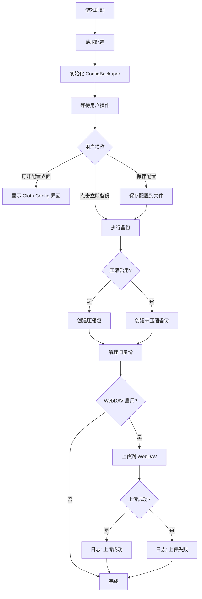
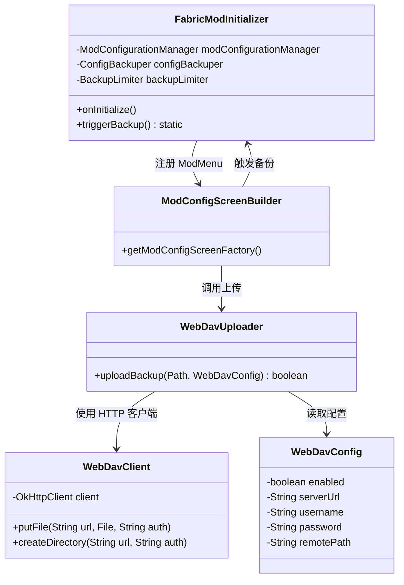

# Config Backuper Fabric Mod 重构计划

## 一、现有备份流程分析

根据现有代码（`FabricModInitializer.java`、`ForgeModInitializer.java`），备份流程如下：

```
游戏启动 (onInitialize)
  ├── 读取配置文件 (config/config-cloud-backuper.json)
  │   └── ModConfigurationManager.read() → ModConfig
  ├── 创建 ConfigBackuper(LOGGER, modConfig)
  ├── 创建 BackupLimiter(LOGGER, modConfig)
  ├── 执行备份: configBackuper.performBackup()
  │   ├── 备份游戏配置 (includeGameConfigs)
  │   ├── 备份模组配置 (includeModConfigs)
  │   ├── 备份着色器配置 (includeShaderPackConfigs)
  │   └── 压缩为 zip 文件 (compressionEnabled)
  └── 清理旧备份: backupLimiter.removeOldBackups()
```

**core 库推断结构：**
- `ModConfig` — 配置 POJO，包含所有配置字段
- `ModConfigurationManager` — JSON 配置读写
- `ConfigBackuper` — 执行备份（压缩指定目录到 zip）
- `BackupLimiter` — 按 maxBackups 清理旧备份文件
- `CriticalConfigBackuperException` — 运行时异常
- `LoggerWrapper` / `LoggerWrapperSlf4j` — SLF4J 日志包装

## 二、总体架构设计

### 修改后的架构

```
游戏启动 (onInitialize)
  ├── 读取配置
  ├── 初始化 ConfigBackuper / BackupLimiter
  └── 不再自动执行备份

玩家打开配置界面 (ModMenu + Cloth Config)
  ├── 显示所有配置项
  ├── "立即备份" 按钮 → 执行备份 + 可选 WebDAV 上传
  └── 保存配置 → 自动触发备份 + 可选 WebDAV 上传

WebDAV 上传（可选）
  └── 备份完成后 → 上传 zip 到 WebDAV 服务器
```

### 新增文件结构

```
fabric/src/main/java/com/configcloudbackuper/configbackuper/
  ├── FabricModInitializer.java          # [修改] 移除自动备份
  ├── config/
  │   ├── ModConfigScreen.java           # [新增] Cloth Config 配置界面
  │   └── ModConfigScreenBuilder.java    # [新增] 配置界面构建器
  ├── webdav/
  │   ├── WebDavClient.java              # [新增] WebDAV 客户端
  │   ├── WebDavConfig.java              # [新增] WebDAV 配置数据类
  │   └── WebDavUploader.java            # [新增] WebDAV 上传管理器
  └── util/
      └── ...                            # 现有工具类

fabric/src/main/resources/
  ├── fabric.mod.json                    # [修改] 添加 ModMenu 入口
  └── assets/config-cloud-backuper/
      └── icon.png                       # 现有图标
```

## 三、详细任务分解

### 任务 1: 删除 Forge/NeoForge 目录，精简项目

**操作步骤：**
1. 删除 `forge/` 整个目录
2. 删除 `neoforge/` 整个目录
3. 更新 `fabric/src/main/resources/fabric.mod.json`：
   - 更新 `description` 描述（不再只是启动时备份）
   - 移除 `suggests` 中的 `another-mod`
   - 添加 ModMenu 入口点 (`modmenu`)
4. 更新 `fabric/build.gradle`：
   - 添加 Cloth Config API 依赖
   - 添加 ModMenu 依赖
   - 添加 WebDAV 相关依赖（okhttp）
5. 更新 `fabric/gradle.properties`：
   - 更新版本号（如 `1.1.0`）
   - 添加新依赖版本号

### 任务 2: 修改核心功能 - 移除自动备份

**修改 `FabricModInitializer.java`：**
1. 移除 `onInitialize()` 中的 `configBackuper.performBackup()` 调用
2. 移除 `backupLimiter.removeOldBackups()` 调用
3. 保留配置读取和对象初始化
4. 将 `configBackuper` 和 `backupLimiter` 实例暴露为静态方法或单例，供配置界面调用
5. 添加 `performBackup()` 公共静态方法，供配置界面触发

**关键代码变更：**
```java
// 修改前
private void initScript() {
    ...
    configBackuper.performBackup();
    backupLimiter.removeOldBackups();
}

// 修改后
private void initScript() {
    ...
    // 不再自动执行备份
    // configBackuper.performBackup();  ← 移除
    // backupLimiter.removeOldBackups();  ← 移除
}

// 新增公共方法供配置界面调用
public static void triggerBackup() {
    instance.configBackuper.performBackup();
    instance.backupLimiter.removeOldBackups();
}
```

### 任务 3: 添加 Cloth Config 配置界面

**使用 ModMenu + Cloth Config API 实现：**

1. **创建 `ModConfigScreenBuilder.java`** — 实现 `ModMenuIntegration` 接口
   - 实现 `getModConfigScreenFactory()` 方法
   - 返回 Cloth Config 的 `ConfigScreen`

2. **创建配置界面** — 使用 Cloth Config API 构建
   - **通用设置区块：**
     - `includeGameConfigs` — 开关 (boolean)
     - `includeModConfigs` — 开关 (boolean)
     - `includeShaderPackConfigs` — 开关 (boolean)
     - `compressionEnabled` — 开关 (boolean)
   - **备份存储设置区块：**
     - `backupFolder` — 文本输入 (String)
     - `backupFilePrefix` — 文本输入 (String)
     - `backupFileSuffix` — 文本输入 (String)
     - `maxBackups` — 整数输入 (int, -1 表示不限)
   - **WebDAV 设置区块：**（见任务 4）
   - **操作按钮：**
     - "立即备份" 按钮 → 调用 `triggerBackup()`
     - "保存" 按钮 → 保存配置 + 自动触发备份

3. **更新 `fabric.mod.json`** — 添加 ModMenu 入口点：
   ```json
   "entrypoints": {
     "main": [...],
     "modmenu": [
       "com.configcloudbackuper.config.ModMenuIntegration"
     ]
   }
   ```

### 任务 4: 添加 WebDAV 云上传功能

1. **创建 `WebDavConfig.java`** — WebDAV 配置数据类
   ```java
   public class WebDavConfig {
       private boolean enabled = false;
       private String serverUrl = "";
       private String username = "";
       private String password = "";
       private String remotePath = "/ConfigBackuper/";
       // getters/setters
   }
   ```

2. **创建 `WebDavClient.java`** — 基于 OkHttp 的 WebDAV 客户端
   - PUT 方法上传文件
   - MKCOL 方法创建远程目录
   - 基本认证 (Base64)
   - 超时设置（连接 10s，读写 60s）
   - 重试机制（最多 3 次）
   - 错误处理与日志

3. **创建 `WebDavUploader.java`** — 上传管理器
   - `uploadBackup(Path backupFile, WebDavConfig config)` — 上传单个备份文件
   - 返回上传结果（成功/失败 + 错误信息）
   - 日志记录

4. **在配置界面中添加 WebDAV 设置区块：**
   - `webdavEnabled` — 开关
   - `webdavServerUrl` — 文本输入
   - `webdavUsername` — 文本输入
   - `webdavPassword` — 密码输入（隐藏显示）
   - `webdavRemotePath` — 文本输入

5. **在备份触发逻辑中集成 WebDAV：**
   - 备份完成后，如果 WebDAV 启用，自动上传
   - 在配置界面添加"立即备份并上传"按钮

### 依赖添加

在 `fabric/build.gradle` 中添加：

```gradle
repositories {
    // ... 现有仓库
    maven { url = 'https://maven.shedaniel.me/' }           // Cloth Config
    maven { url = 'https://maven.terraformersmc.com/releases' } // ModMenu
}

dependencies {
    // ... 现有依赖
    
    // Cloth Config API
    modImplementation "me.shedaniel.cloth:cloth-config-fabric:${project.cloth_config_version}"
    
    // ModMenu
    modCompileOnly "com.terraformersmc:modmenu:${project.modmenu_version}"
    
    // OkHttp for WebDAV
    include(implementation("com.squareup.okhttp3:okhttp:${project.okhttp_version}"))
    
    // Okio (OkHttp 依赖)
    include(implementation("com.squareup.okio:okio:${project.okio_version}"))
}
```

在 `fabric/gradle.properties` 中添加：

```properties
# Dependencies
cloth_config_version=11.1.118
modmenu_version=7.2.2
okhttp_version=4.12.0
okio_version=3.6.0
```

## 四、Mermaid 流程图

### 备份触发流程



### 类依赖关系



## 五、执行顺序

1. **任务 1**: 删除 Forge/NeoForge → 更新 build.gradle 和 fabric.mod.json
2. **任务 2**: 修改 FabricModInitializer.java（移除自动备份，暴露公共方法）
3. **任务 3**: 创建配置界面（ModMenu + Cloth Config）
4. **任务 4**: 添加 WebDAV 上传功能
5. **最终验证**: 检查所有文件一致性，确保编译通过
